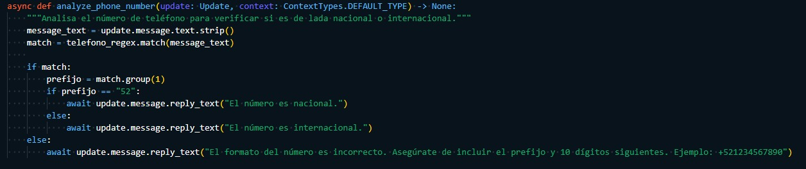

# BOT DE TELEGRAM

## Bot que identifica si un numero pertenece a una lada nacional o internacional, se utilizó la siguiente expresión regular para verificar el patrón de digitos

- telefono_regex = re.compile(r"^\+?(\d{1,2})(\d{10})$") --> Esta expresión regular nos ayuda a identificar cadenas de números con un prefijo de 1 o 2 números y 10 números después de este

## Ejemplo de la utilización

Se implementó una función que comparará de entrada el prefijo para verificar si es '52' 

