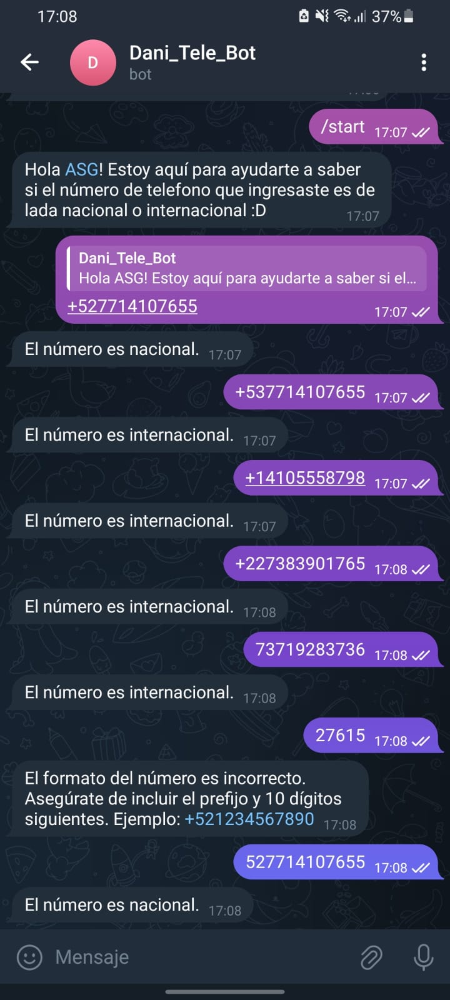

# BOT DE TELEGRAM

## Bot que identifica si un numero pertenece a una lada nacional o internacional, se utilizó la siguiente expresión regular para verificar el patrón de digitos

- telefono_regex = re.compile(r"^\+?(\d{1,2})(\d{10})$")

## Ejemplo de la utilización

